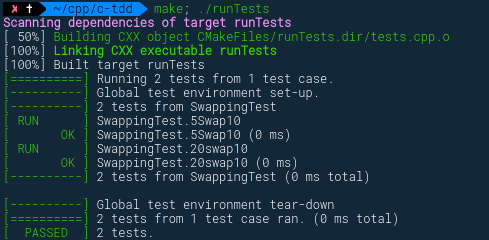

# TDD in CPP

> Use GTest to testing c++

## Required

* g++
* cmake
* GTest

___

* [Docs for install GTest](https://www.eriksmistad.no/getting-started-with-google-test-on-ubuntu/)

## Run With G++

```sh
g++ -o swap main.cpp # complies to binary
./swap # run
```

## Run Test

```sh
cmake CMakeLists.txt # run first time only
make # build test
./runTests # run
```

## Results

### Test Failed



## Test Pass

